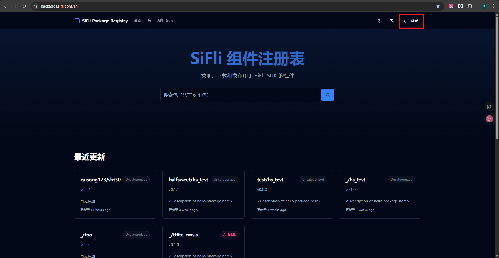
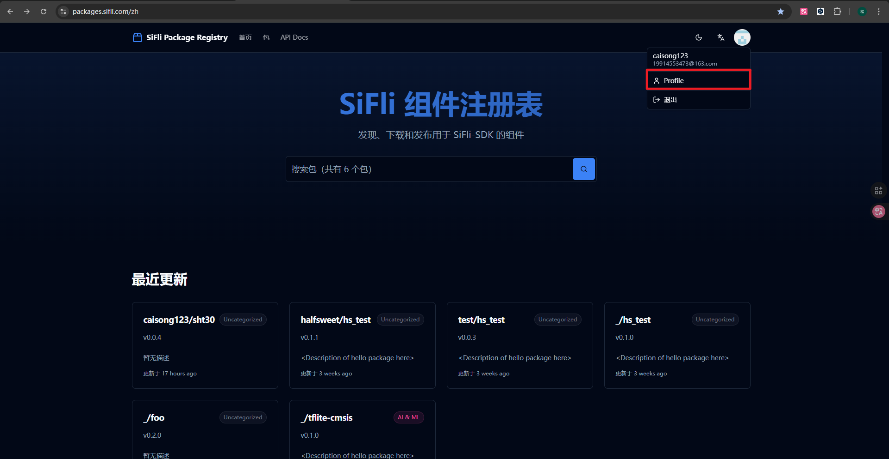
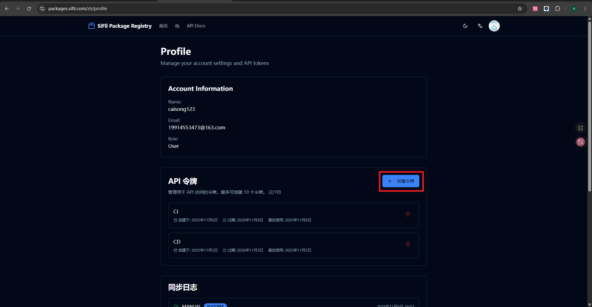
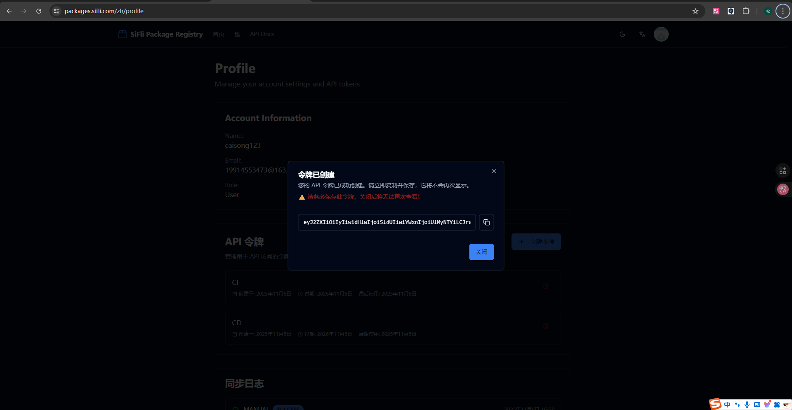
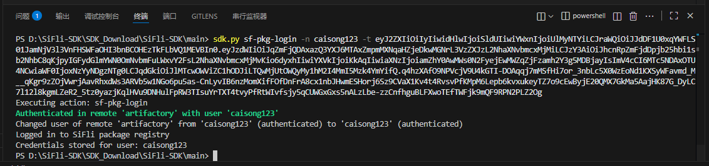
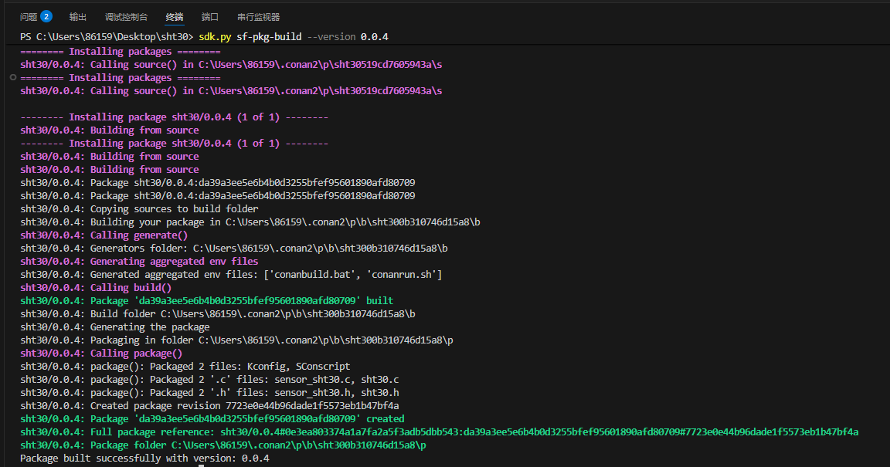
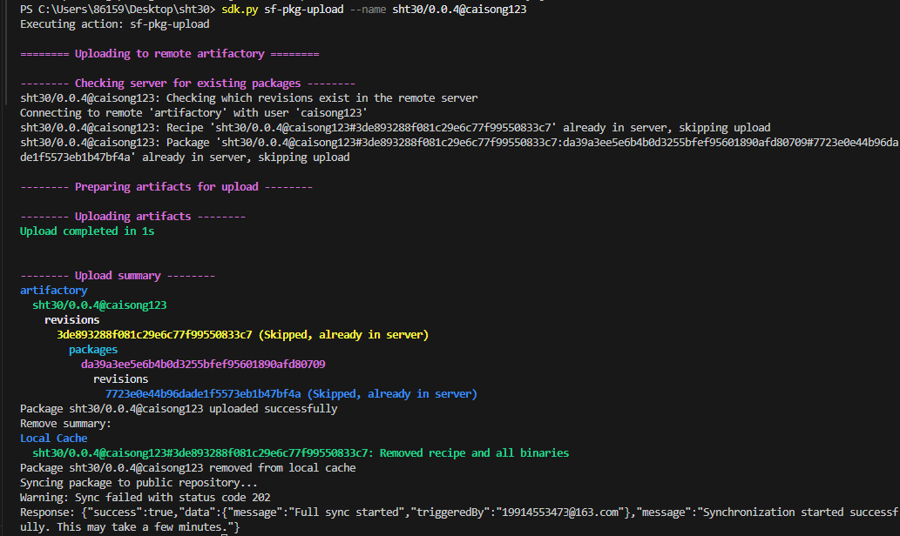
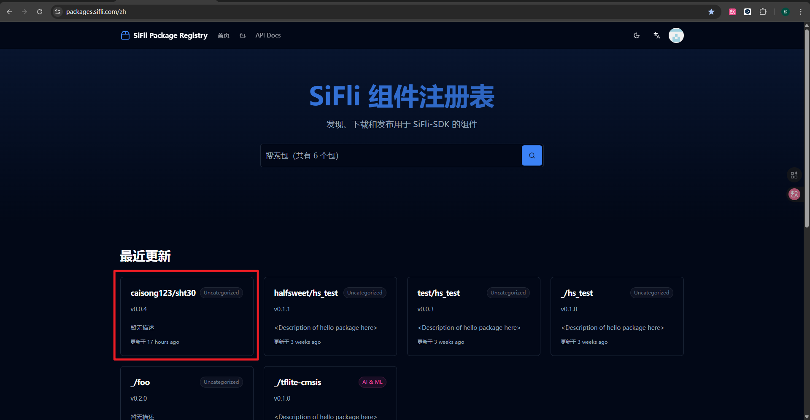

# 创建并上传 SF-PKG 包

本节介绍如何登录、创建、构建并上传自己的 SF-PKG 包。

## 获取访问令牌

1. 打开 <https://packages.sifli.com/zh>，使用 GitHub 账号登录，用户名即为 GitHub 用户名（全小写）。
2. 登录后进入 **Profile**。
3. 在个人中心申请访问令牌（Token），并妥善保存，后续用于 `sdk.py sf-pkg-login` 命令。






```{note}
每台电脑只需登录一次，登录信息会保存在本地。
```

## 登录 sf-pkg

```bash
sdk.py sf-pkg-login -n <小写的GitHub用户名> -t 获取的 token
```



```{warning}
-n参数必须是小写的GitHub用户名！否则会导致上传失败。
```

## 创建包配置（sf-pkg-new）

准备驱动文件夹后，在终端进入该目录并执行：

```bash
sdk.py sf-pkg-new --name <package_name>
```

可选参数：

- `--version`：包版本号
- `--license`：许可证声明
- `--author`：作者
- `--support-sdk-version`：支持的 SiFli-SDK 版本

示例（携带版本和作者信息）：

```bash
sdk.py sf-pkg-new --name <package_name> --version 1.0.0 --author yourname
```

命令成功后会生成一个 `conanfile.py` 文件，具体的描述可以参考 [Conan 官方文档](https://docs.conan.io/en/latest/reference/conanfile.html)。

一般来说，`conanfile.py` 文件中内容默认如下：

```python
from conan import ConanFile

class Example_AddRecipe(ConanFile):
    name = "example_add"
    version = "0.1.0"

    license = "Apache-2.0"
    user = "halfsweet"
    author = "halfsweet"
    url = "<Package recipe repository url here, for issues about the package>"
    homepage = "<Package homepage here>"
    description = "<Description of hello package here>"
    topics = ("<Put some tag here>", "<here>", "<and here>")

    support_sdk_version = "^2.4"

    # Sources are located in the same place as this recipe, copy them to the recipe
    exports_sources = "*"

    python_requires = "sf-pkg-base/[^1.0]@sifli"
    python_requires_extend = "sf-pkg-base.SourceOnlyBase"


    def requirements(self):
        # add your package dependencies here, for example:
        # self.requires("fmt/8.1.1")
        pass
```

我们需要着重关注以下参数：
- `name`：包名称，必填项，用于在`https://packages.sifli.com`中作为唯一标识。
- `version`：包版本号，建议使用语义化版本号，如 `0.0.1`、`1.0.0` 等。
- `user`：在 `https://packages.sifli.com` 上的用户名，也叫`namespace`，必选项。
- `license`：开源协议，常见的有 `Apache-2.0`、`MIT`、`GPL-3.0`、`BSD-3-Clause` 等，默认是 `Apache-2.0`。
- `author`：包作者/维护者名称，可选项。
- `url`：包的仓库地址 (GitHub/GitLab 等），可选项。
- `description`：包的详细描述，可选项。
- `topics`：包的标签/主题，便于搜索和分类，使用元组形式，可选项。
- `support_sdk_version`：支持的 SiFli-SDK 版本，必选项，格式为 [语义化版本范围](https://semver.org/)。

其中，`user`和`name`组合起来将作为包的唯一标识。

`requirements` 方法用于添加依赖包

```python
def requirements(self):
    # add your package dependencies here, for example:
    # self.requires("fmt/8.1.1")
    pass
```

在这里代表了什么都没有添加任何依赖包。我们可以在 `requirements` 方法中添加需要的包，例如：

```python
def requirements(self):
    self.requires("sht30/0.0.4@caisong123")
```

`self.requires` 用于指定依赖包，其中的格式为 `包名/版本号@用户名`。

## 构建包（sf-pkg-build）

在驱动文件夹下执行：

```bash
sdk.py sf-pkg-build --version 版本号
```



> 版本号建议使用语义化版本号，如 `0.0.1`、`1.0.0` 等。

## 上传包（sf-pkg-upload）

```bash
sdk.py sf-pkg-upload --name 包名/版本号@用户名
```



命令格式说明：

- `包名`：在 `conanfile.py` 中定义的包名
- `版本号`：构建时指定的版本号
- `用户名`：你的 GitHub 用户名

### 上传失败的处理

1. 清除本地缓存：
   ```bash
   sdk.py sf-pkg-remove --name 包名
   ```
2. 重新构建：
   ```bash
   sdk.py sf-pkg-build --version 版本号
   ```
3. 再次上传：
   ```bash
   sdk.py sf-pkg-upload --name 包名/版本号@用户名
   ```

### 验证上传结果

上传成功后，可在服务器网站上看到已上传的包：


