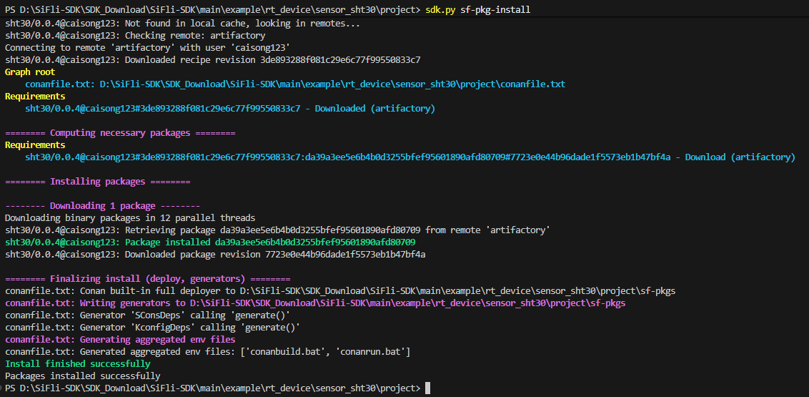

# 在工程中使用 SF-PKG

以下步骤说明如何在现有工程中安装和使用 SF-PKG 依赖。

## 初始化依赖（sf-pkg-init）

```bash
sdk.py sf-pkg-init
```

执行成功后，会在 `project` 目录下生成 `conanfile.py` 文件：

`conanfile.py`是 Conan 的配置文件，用于定义项目所需的依赖包。详细资料可参考 [Conan 官方文档](https://docs.conan.io/en/latest/reference/conanfile.html)。在此处我们可以先忽略其中的大部分内容，只需要关注`requires` 字段即可。

一般来说，自动生成的 `conanfile.py` 文件中都有一个类似的 `requires` 字段：
```python
requires = (
        # "core-lib/1.0.0",
    )
```
在这里代表了什么都没有添加任何依赖包。我们可以手动添加需要的包，例如添加一个 SHT30 传感器驱动包：

```python
requires = (
    "sht30/0.0.4@caisong123",
)
```

每个依赖包的格式为 `<包名>/<版本号>@<用户名>`。

## 搜索可用的包

如果不确定包名或版本号，可以搜索：

```bash
sdk.py sf-pkg-search <package_name>
```

示例：

```bash
sdk.py sf-pkg-search sht30
```

## 安装依赖（sf-pkg-install）

在工程的 `project` 目录下执行：

```bash
sdk.py sf-pkg-install
```



安装成功后，会在 `project` 目录下生成 `sf-pkgs` 文件夹，其中包含了我们所安装的包。

## 使用驱动

安装完成后即可直接使用驱动：

- 可以直接编译
- include 头文件时无需填写绝对路径，Conan 会自动处理路径配置

### Kconfig 配置注意事项

- `menuconfig` 会自动整合 `sf-pkgs` 文件夹下的所有 `Kconfig` 文件
- 这些配置项会出现在 `menuconfig` 的 **SiFli External Components** 菜单中
