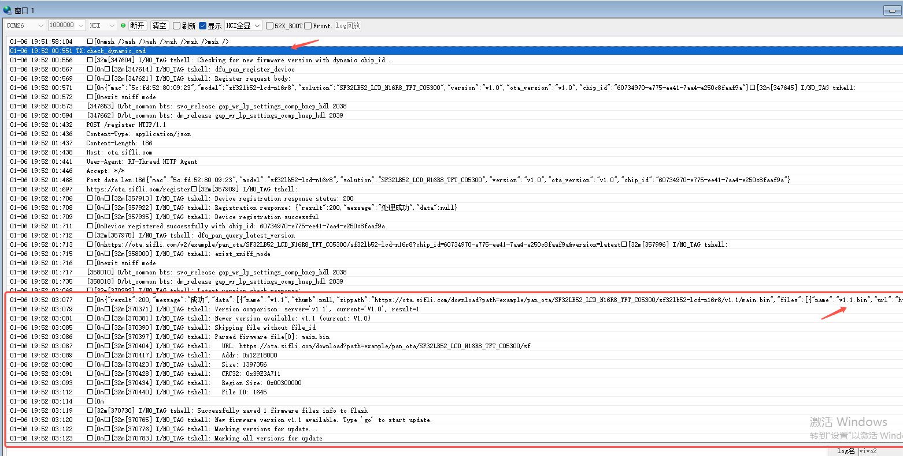
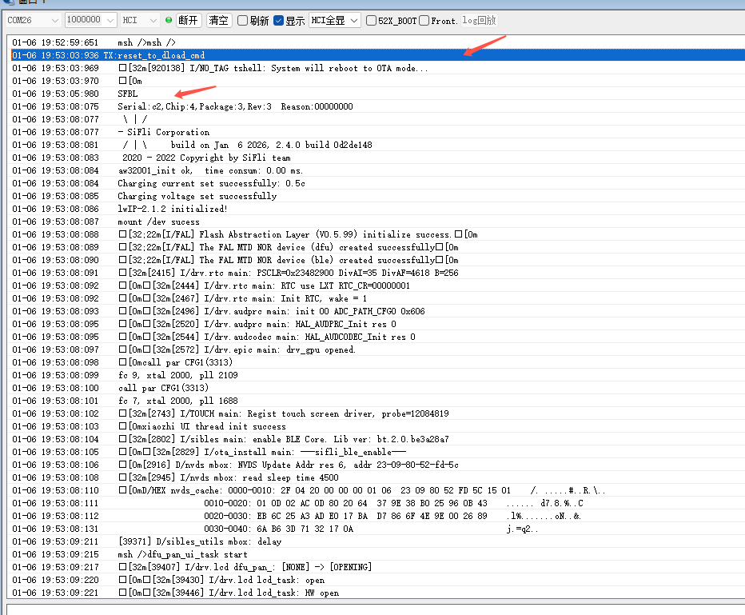
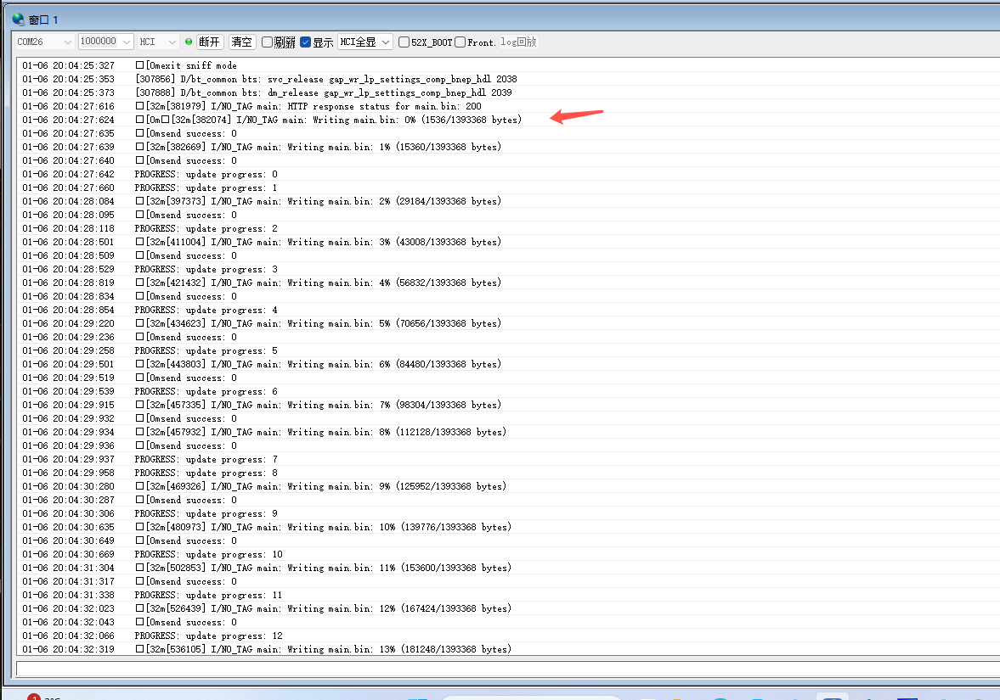
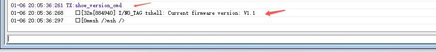

# BT PAN OTA示例

源码路径：example/bt/pan_ota


## 支持的平台
<!-- 支持哪些板子和芯片平台 -->
+ sf32lb52-lcd_n16r8
+ sf32lb52-lchspi-ulp


## 概述
<!-- 例程简介 -->
本例程演示通过蓝牙连接手机的PAN协议后，通过Finsh命令向特定服务器注册设备，获取固件版本，并支持通过OTA方式进行固件升级。

##  添加 CA 证书
1. 存放签名机构根证书
- `external/mbedtls_288/certs/default` 目录中存储着常用的 CA 证书文件
- `certs` 目录下存储着用户增加的 CA 证书文件

如果 `certs/default` 目录下没有包含用户需要的 CA 根证书文件<br>
则需要用户将自己的 PEM 格式的 CA 证书拷贝到“certs”根目录下。（仅支持 PEM 格式证书，不支持 DER 格式证书）<br>
添加证书与`DigiCert_Global_Root_CA2.crt`并列存放    


2. 证书格式说明 
- `PEM 格式证书`

    **PEM 格式证书** 通常是以 **.pem** 和 **.cer** 后缀名结尾的文件。

    使用文本编辑器打开后，文件内容以 `-----BEGIN CERTIFICATE-----` 开头，以 `-----END CERTIFICATE-----` 结尾。
- `DER 格式证书`

    **DER 格式证书** 是二进制文件类型。<br>

3. 查看配置

查看proj.conf里如果开了PKG_USING_MBEDTLS_USER_CERTS，就会把certs根目录下的所有文件都合并到ports/src/tls_certificate.c


## 例程的使用
<!-- 说明如何使用例程，比如连接哪些硬件管脚观察波形，编译和烧写可以引用相关文档。
对于rt_device的例程，还需要把本例程用到的配置开关列出来，比如PWM例程用到了PWM1，需要在onchip菜单里使能PWM1 -->
1. 连接之前最好确保手机已经打开网络共享，如果在BT连接以后才打开共享网络，可以通过finsh命令"pan_cmd conn_pan"重新连接PAN从而连接到网络
    1) IOS打开网络共享。IOS需要确保装备了SIM卡，打开个人网络热点即可：\
    
    2) 不同安卓打开网络共享的路径不同，但都是在个人热点共享里面找到蓝牙网络共享并打开。安卓可以在连接WiFi基础上打开蓝牙共享网络：\
    
2. 例程开机会打开蓝牙的Inquiry scan和psage scan，用手机等设备可以搜索到本机并发起连接，本机的蓝牙名称默认是sifli_pan。
3. 手机开启网络共享下，PAN协议才会连接成功，可以从log里面找到"pan connect successed"的打印。并且确保手机本身可以上网的情况下，再执行命令
4. 本例程支持OTA功能，可以实现固件的远程升级。在使用OTA功能前，需要在SConstruct文件中添加以下配置：
   ```
   if GetDepend('USING_DFU_PAN'):
       AddDFU_PAN(SIFLI_SDK)
   ```
   
   OTA功能提供了以下命令：
   - `check_dynamic_cmd` - 注册设备到OTA服务器并检查新固件版本，有新版本则会设置更新标志位
   - `reset_to_dload_cmd` - 检查更新标志位，重启设备进入OTA下载模式
   - `show_version_cmd` - 显示当前固件版本信息

### 硬件需求
运行该例程前，需要准备：
+ 一块本例程支持的开发板([支持的平台](#Platform_pan))。
+ 手机。
+ 布置好版本文件在服务器上，并对应build_ota_query_url下构建的URL

### menuconfig配置

1. 使能蓝牙(`BLUETOOTH`)：
    - 路径：Sifli middleware → Bluetooth
    - 开启：Enable bluetooth
        - 宏开关：`CONFIG_BLUETOOTH`
        - 作用：使能蓝牙功能
2. 使能PAN & A2DP，A2DP是为了避免IOS不支持单独连接PAN：
    - 路径：Sifli middleware → Bluetooth → Bluetooth service → Classic BT service
    - 开启：Enable BT finsh（可选）
        - 宏开关：`CONFIG_BT_FINSH`
        - 作用：使能finsh命令行，用于控制蓝牙
    - 开启：Manually select profiles
        - 宏开关：`CONFIG_BT_PROFILE_CUSTOMIZE`
        - 作用：手动选择使能的配置文件
    - 开启：Enable PAN
        - 宏开关：`CONFIG_CFG_PAN`
        - 作用：使能PAN协议
3. 使能BT connection manager：
    - 路径：Sifli middleware → Bluetooth → Bluetooth service → Classic BT service
    - 开启：Enable BT connection manager
        - 宏开关：`CONFIG_BSP_BT_CONNECTION_MANAGER`
        - 作用：使用connection manager模块管理bt的连接
4. 使能NVDS：
    - 路径：Sifli middleware → Bluetooth → Bluetooth service → Common service
    - 开启：Enable NVDS synchronous
        - 宏开关：`CONFIG_BSP_BLE_NVDS_SYNC`
        - 作用：蓝牙NVDS同步。当蓝牙被配置到HCPU时，BLE NVDS可以同步访问，打开该选项；蓝牙被配置到LCPU时，需要关闭该选项
5. 蓝牙自动连接需要打开的menuconfig：
    - 路径：Sifli middleware → Bluetooth → Bluetooth service → Classic BT service
    - 开启：Enable BT connection manager 后，会默认开启 Re-connect to last device if connection timeout happened or system power on
        - 宏开关：`CONFIG_BT_AUTO_CONNECT_LAST_DEVICE`
        - 作用：使能自动连接上次连接的设备。  
    - 路径：Third party packages
    - 开启：FlashDB: Lightweight embedded database，一般为默认开启
        - 宏开关：`CONFIG_PKG_USING_FLASHDB`
        - 作用：启用FlashDB数据库，在断电或重启后依然能保留重要数据。
6. 使能DFU PAN功能：
    - 路径：Sifli middleware → Using dfu pan
    - 开启：Using dfu pan
        - 宏开关：`CONFIG_USING_DFU_PAN`

### 编译和烧录
切换到例程project目录，运行scons命令执行编译：
```c
> scons --board=eh-lb525 -j32
```
切换到例程`project/build_xx`目录，运行[uart_download.bat]，按提示选择端口即可进行下载：
```c
$ ./uart_download.bat

     Uart Download

please input the serial port num:5
```
关于编译、下载的详细步骤，请参考[快速入门](/quickstart/get-started.md)的相关介绍。

## 例程的预期结果
<!-- 说明例程运行结果，比如哪几个灯会亮，会打印哪些log，以便用户判断例程是否正常运行，运行结果可以结合代码分步骤说明 -->
例程可以通过连接手机的PAN协议，执行命令后能正确注册设置至服务器，查询版本能返回json格式的版本信息。
```json
注意: dfu_pan_query_latest_version()会获取服务器返回的json数据，并将固件结构体写入flash地址，以便后面直接下载，json如下，其中v1.1.bin是占位符文件，需要与固件文件放在一起，并与当前文件夹名称一致

{
  "result": 200,
  "message": "成功",
  "data": [
    {
      "name": "v1.1",
      "thumb": null,
      "zippath": "https://xxx.xxx.com/download?path=example/SF32LB52_LCD_N16R8_TFT_CO5300/sf32lb52-lcd-n16r8/v1.1/v1.1.bin",
      "files": [
        {
          "file_id": 391,
          "file_name": "main.bin",
          "file_size": 4087608,
          "crc32": "0x1026622b",
          "addr": "0x12460000",
          "region_size": "0x00680000",
          "note": null,
          "name": "main.bin",
          "url": "https://xxx.xxx.com/download?path=example/SF32LB52_LCD_N16R8_TFT_CO5300/sf32lb52-lcd-n16r8/v1.1/main.bin"
        },
        {
          "name": "v1.1.bin",
          "url": "https://xxx.xxx.com/download?path=example/SF32LB52_LCD_N16R8_TFT_CO5300/sf32lb52-lcd-n16r8/v1.1/v1.1.bin",
          "addr": "",
          "size": "",
          "crc32": "",
          "region_size": "",
          "note": ""
        }

      ]
    }
  ]
}
```
连接好pan之后：

执行"check_dynamic_cmd"命令后，会打印如下信息：


执行"reset_to_dload_cmd"命令后，会打印如下信息：

升级进度，也可通过屏幕UI观察进度

执行"show_version_cmd"命令后，会打印如下信息：

表示从 v1.0 成功升级到 v1.1

## 异常诊断


## 参考文档
<!-- 对于rt_device的示例，rt-thread官网文档提供的较详细说明，可以在这里添加网页链接，例如，参考RT-Thread的[RTC文档](https://www.rt-thread.org/document/site/#/rt-thread-version/rt-thread-standard/programming-manual/device/rtc/rtc) -->

## 更新记录
|版本 |日期   |发布说明 |
|:---|:---|:---|
|0.0.1 |12/2025 |初始版本 |


