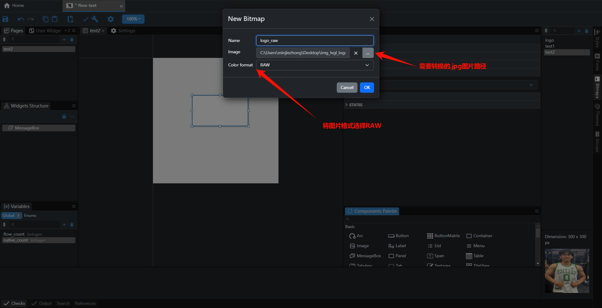
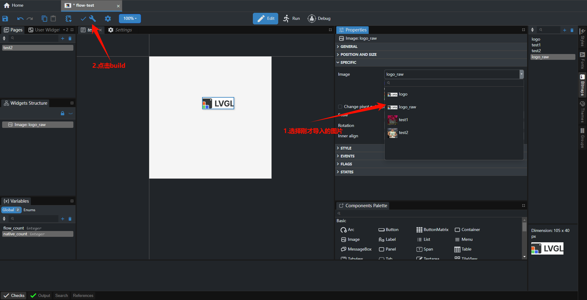
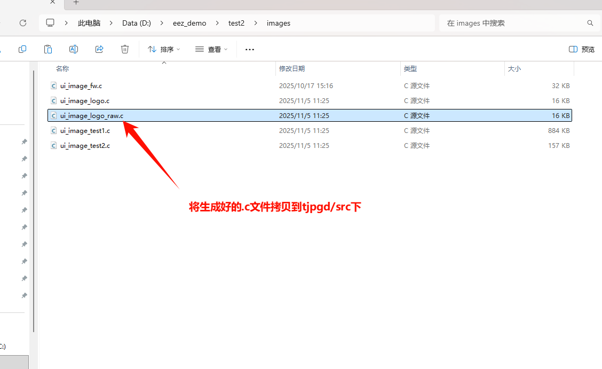
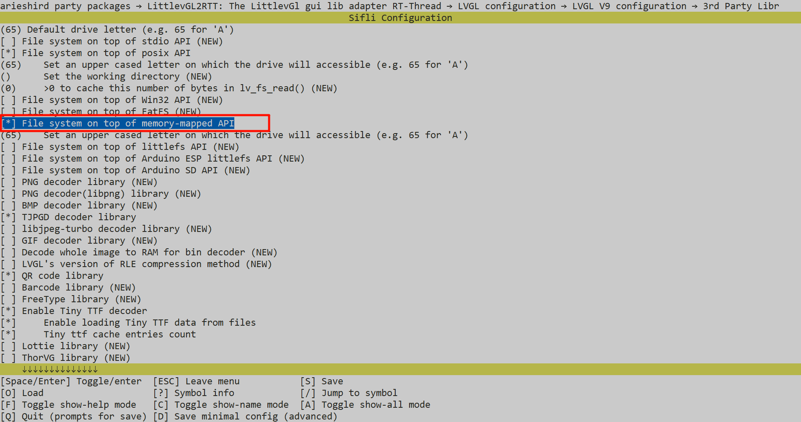

```markdown|CODE_EDIT_BLOCK|d:\SiFli-SDK\SiFli-SDK\example\multimedia\lvgl\lvgl_v9_examples\README_EN.md
# LVGL v9 Official Example
## Introduction
This example is used to test LVGL V9 APIs with the official provided examples.
You can replace the lv_example_scroll_1() function in src/main.c (simulator is in simulator/applications/application.c) to test other APIs.
For other API functions, refer to the function definitions in src/examples/lv_examples.h.

## Project Compilation and Download:
The board project is located in the project directory and can be compiled for a specific board by specifying the board,
- For example, to compile a project that can run on HDK 563, execute scons --board=eh-lb563 to generate the project
- Downloading can be done through the download.bat in the build directory. For example, to flash the 563 project generated in the previous step, you can execute .\build_eh-lb563\download.bat to download via jlink
- It should be noted that for SF32LB52x/SF32LB56x series, an additional uart_download.bat will be generated. You can execute this script and input the download UART port number to perform the download
The simulator project is in the simulator directory,
- Compile using scons, the SiFli-SDK/msvc_setup.bat file needs to be modified accordingly to match the local MSVC configuration
- You can also use scons --target=vs2017 to generate an MSVC project project.vcxproj and compile using Visual Studio.

```{note}
Note: If you are not using VS2017, for example VS2022, when loading the project, you will be prompted to upgrade the MSVC SDK. After upgrading, it can be used.
``` 

## How to Use Tjpgd
Source path: SiFli-SDK\example\multimedia\lvgl\lvgl_v9_examples
### Supported Platforms
The example can run on the following development boards
+ sf32lb52-lchspi-ulp
+ sf32lb52-lcd series
+ sf32lb56-lcd series
+ sf32lb58-lcd series


### Overview
* Mount the file system by inserting an SD card, then read .jpg format images from it and display them on the screen

### Hardware Requirements
* Huangshan development board or 52x series development board
* A USB data cable with data transmission capability
* A TF card and a TF card reader

### Example Usage
#### Compilation and Flashing
The demo code displays the image by default: ``` flower.jpg ``` 

Switch to the example project directory and run the scons command to compile:

```
scons --board=sf32lb52-lchspi-ulp -j8
```

Execute the flashing command
```
build_sf32lb52-lchspi-ulp_hcpu\uart_download.bat
```

Follow the prompts to select the port for downloading:

```none
please input the serial port num:5
```

#### Example Output Results:
* After inserting the SD card, mount the file system and read images from the file system and display image logs. If the log contains `mount fs on flash to root success`, it indicates that the file system was mounted successfully


* You can input ls to view image files in the file system


### Example Effect Display


#### Example Configuration Process
* By default, SPI is not enabled for TF file system mounting. If needed, configure as follows
* First, you can use a TF card reader to write image files to the TF card, then insert the TF card into the board
* Perform the following configuration through menuconfig, the specific operation is as follows
``` c
menuconfig --board=sf32lb52-lchspi-ulp
```
* Enable SPI bus


* Mount the SD\TF device on the SPI bus


* Configure file path


* Enable LVGL file system interface, configure drive letter, and enable decoder


### tjpgd (Extension)

### Overview
* Decode LV_IMAGE_SRC_VARIABLE type using the tjpgd decoder

### Image Format Conversion
* First, .jpg images need to be converted to RAW data. The conversion tool eez_studio can be used for conversion. Refer to the following for specific operations






* Then set the image array, the jpegd decoder will select the corresponding decoding method based on the set type

### Configuration Process
* Perform the following configuration through menuconfig, the specific operation is as follows:
Enable LV_USE_FS_MEMFS macro


The example has already converted `img_lvgl_logo.jpg` to RAW data `ui_image_logo.c`

### Troubleshooting
* Abnormal log

If the above situation occurs, the TF card may be loose, the TF card cannot communicate normally, or the TF card is not inserted
```